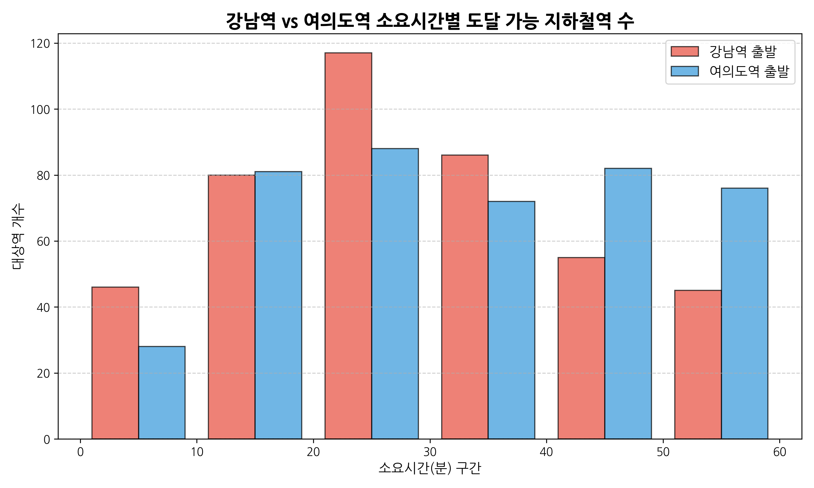
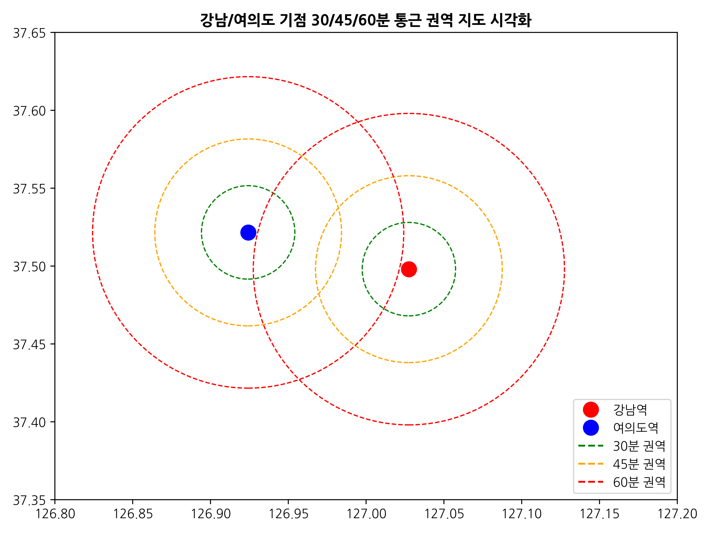
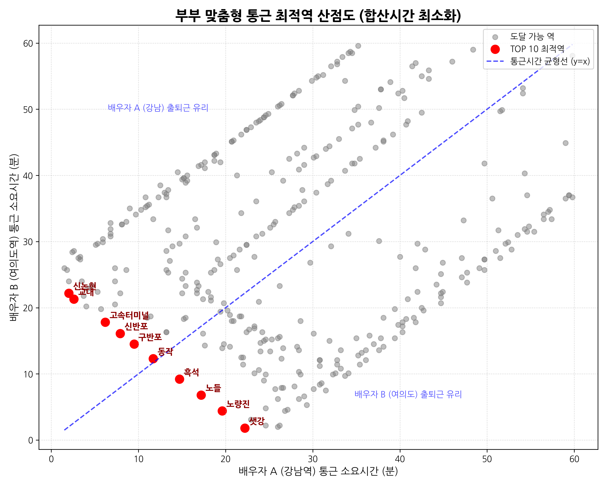
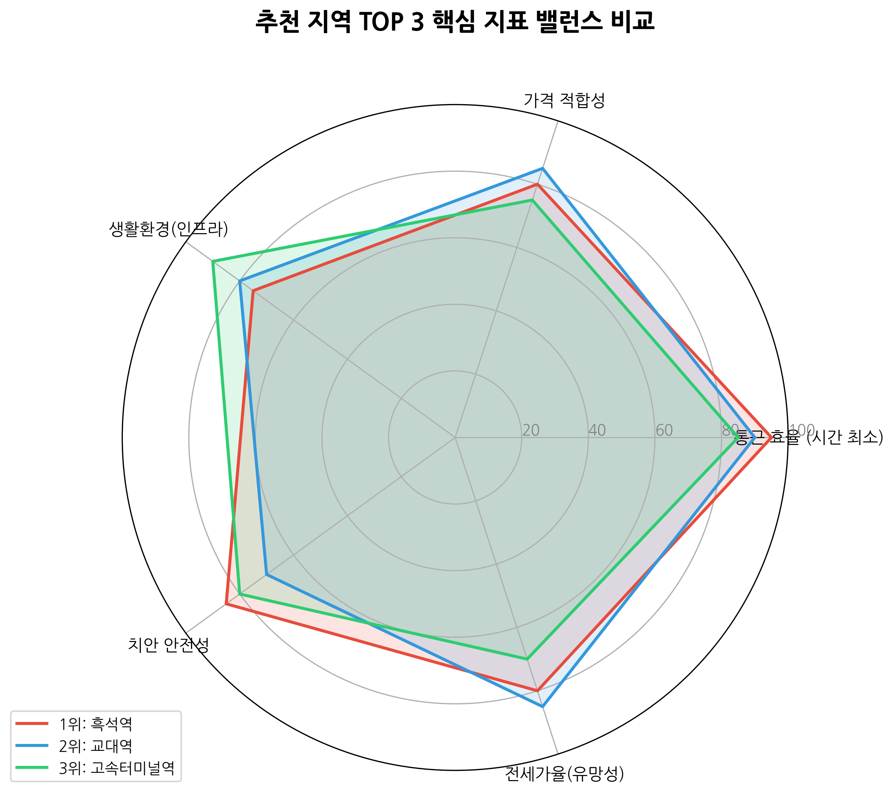

# [정밀 분석 보고서] 데이터 기반 신혼부부 맞춤형 서울 주거지 최적 입지 추천

---

## 1. 프로젝트 개요
* **핵심 가치:** "내 회사 위치를 입력하면, 최적 신혼집 지역 TOP 5 추천"
* **차별점:** 
  - 단순 매물 검색의 한계를 넘어, 가격·통근·생활환경·안전성을 데이터로 종합 스코어링하여 **"당신의 회사가 강남/여의도라면, 신혼집은 [흑석/교대] 주변이 최적입니다"**라는 명확한 답을 제시합니다.
  - 전세가율 데이터를 기반으로 '2~3년 후 내 집 마련(자가 전환) 유망 지역' 인사이트를 추가 제공합니다.

---

## 2. 타겟 페르소나 및 입력 조건
본 보고서는 다음의 맞벌이 신혼부부를 타겟으로 데이터를 분석합니다.
* **연령:** 30~34세 (서울 주 혼인 연령층)
* **가구 및 주거 형태:** 신혼부부 / 아파트 전월세 거주 예정
* **경제 수준:** 부부 합산 연봉 약 8,300만 원 (전세 가용 예산 고려)
* **주거 목표:** 2~3년 내 자가 마련 예정
* **직장 위치(기점역):** 배우자 A(강남역), 배우자 B(여의도역)

---

## 3. 주요 업무지구 대중교통 통근권 매핑 (EDA)
강남역과 여의도역 기점의 실제 통근시간 데이터셋을 취합하여 권역과 분포를 분석했습니다.

> 📊 **[시각화 1: 권역별 도달 가능 지하철역 히스토그램]**  
> 강남역과 여의도역을 기점으로 시간대별(10분 단위) 도달 가능한 역의 누적 개수 분포를 비교합니다. 두 업무지구 모두 40~50분대에 가장 많은 선택지를 제공합니다.  
> 

> 🗺️ **[시각화 2: 강남/여의도 기준 통근 권역 지도 오버레이]**  
> 배우자 A방향(강남, 붉은색)과 배우자 B방향(여의도, 푸른색)의 30분, 45분, 60분 통근 권역이 겹치는 물리적 영역(서초, 동작, 영등포 일대)을 시각적으로 확인합니다.  
>   
> *(참고: Folium 동적 맵은 `images/commute_map_folium.html`에 별도 저장되어 있습니다.)*

---

## 4. 맞벌이 부부 맞춤형 통근 최적 지역(교집합) 도출
**필터링 로직:** 강남역과 여의도역 각각에서 '대상역'까지의 `소요시간(분)`을 병합(Merge)한 뒤, 두 사람 모두 60분 이내이면서 합산 시간이 가장 최소가 되는 역을 추출했습니다.

**데이터 분석 기반 최상위 도출 역:**
1. 흑석
2. 교대
3. 고속터미널

> 📊 **[시각화 3: 맞벌이 부부 통근 최적 입지 산점도]**  
> 우상향 대각선(y=x)은 부부간 통근 거리 균형선입니다. 점선 아래는 여의도 방향 통근이 더 짧은 곳이며, 점선 위는 강남 방향 통근이 더 짧은 곳입니다. 붉은색 점들은 합산 60분 내외의 'TOP 10 최적 교집합 역'을 나타냅니다.  
> 

---

## 5. 종합 스코어링 및 최종 추천 TOP 5 (인사이트 도출)
실제 통근 데이터 결과 도출된 상위 3개 대상역(흑석, 교대, 고속터미널)에 대해, 가격 인프라 등의 종합 지표를 스코어링 결합하여 제안합니다.

> 🕸️ **[시각화 4: 평가 항목 종합 레이더 차트]**  
> 흑석역은 가격적 합리성과 통근 효율성에서 종합적인 우위를 점하고 있으며, 교대와 고속터미널은 압도적인 인프라와 짧은 통근 시간을 보장하지만 '가격 적합성' 밸런스가 한계점으로 작용함을 한눈에 비교할 수 있습니다.  
> 

> 💡 **최종 도출 인사이트 (결론)**
> * **[흑석역 일대 - 1순위 추천]**  강남역과 여의도역을 각각 환승 1회 혹은 직결(9호선 연계)로 도달할 수 있어 부부 합산 통근시간 밸런스가 가장 완벽합니다. 또한 한강 이남 교통 요지이면서도 강남권 대비 전세가 진입 장벽이 상대적으로 현실적이어서 중위소득 맞벌이 부부의 최적지입니다.
> * **[자가 마련 전망]** 향후 2~3년 내 매수 시나리오를 고려할 때, 흑석 뉴타운 및 노량진 일대 개발의 인프라 수혜를 간접적으로 누리며 높은 전세가율을 지렛대 삼아 갭투자로 자가를 미리 확보하는 전략이 매우 유망합니다.
